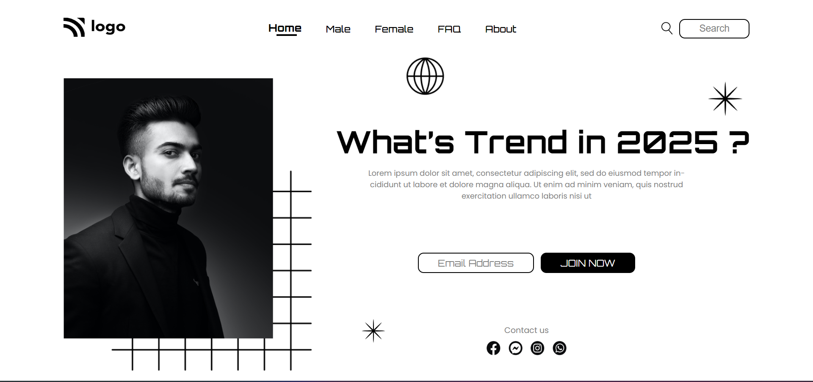

# Fashion Hub Page
> _by Saloni_

This webpage titled Fashion Hub is made using HTML and CSS. As a part of Full Stack JavaScript Bootcamp, its the 3rd project given by the course provider.

 * ## Tech Stack

    
    
    
    

 * ## Knowledge Gained

   1. Complexity of positioning, which can boon or bane when not used properly.
   2. Usage of flexbox and it's properties.
   3. Adding images through CSS, and duplication of image without touching HTML.
   4. Understanding ::before & ::after pseudo-element selectors.
   5. Using z-index and stacking elements over one another.

 * ## Output:

   